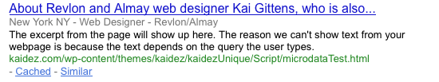

*MUCH thanks to at Oli Studholme at HTML5 Doctor for helping me understand this!!!!*

*Update July 28, 2013: Not only are many points in this post erroneous, but the correct points are a bit outdated. The [schema.org](http://schema.org/) library is recommened for marking up microdata instead of the older data-vocabulary.org one.*

*Update February 21, 2011: Oli looked at this post and suggested some code & semantics changes. Simply put, there are a lot of semantic mistakes in this article. The code below was changed as per his suggestions but the semantics were many. So many that it was easier to create a new post listing them instead of editing this article. Review the code below as it contains his edits, then [read my post listing his semantic suggestions](update-html5seomicrodata-post/). – k*

I’ve learned a few things about how HTML5 handles search engine optimization, or, SEO. The main thing I’ve learned is that we all need to fully understand microdata since Google uses it to collect detailed information about your web page.

While I’m still learning about microdata, I understand 95% of it…and let me be clear from the beginning about what I do understand:

  * **Microdata’s main job is to provide extra information about your site to search engines and machine readers so they can better understand the site content.**
  * **Microdata MUST be written in 100% pure HTML5.**
  * **Microdata does not make page content more meaningful or more keyphrase-rich.**
  * **As with all SEO best practices, Microdata does not guarantee you a high Google site ranking.**
  * **Hope I was clear. Now let’s move on...**

Often called "HTML5′s best kept secret," Microdata, allows you to place a custom vocabulary of data onto your web page. "If the microdata uses a Google "rich snippet" vocabulary, it may also be used by Google".

Let’s see it in action:

I recently created this test page with the following code:


<section itemscope itemtype="http://www.data-vocabulary.org/Person">

  

  <h1 class="entry-title">About Kai Gittens, AKA Kaidez</h1>
   
  <h2>Posted by Kai Gittens  on January 24th</abbr></h2>
   
  <h2 class="updated">January 24, 2011</time></h2>
      <dl>
        <dt>Name</dt>
        <dd itemprop="name">Kai Gittens</dd>
   <dt>Position</dt>
        <dd>
  Founder of kaidez.com</dd>
        <dd>
  Web Designer for Revlon/Almay</dd>
    
        <dt>Mailing address</dt>
        <dd itemprop="address" itemscope itemtype="http://data-vocabulary.org/Address">
          237 Park Ave.

          New York  ,   NY  10017
          USA  
        </dd>
      </dl>
      <h2>Social Networking Info  </h2>
      <ul>
        <li><a href="http://kaidez.com/" itemprop="url">Blog</a></li>
        <li><a href="http://facebook.com/kaidez" itemprop="url">Facebook Profile</a></li>
        <li><a href="http://www.twitter.com/kaidez" itemprop="url">Twitter Page  </a></li>
      </ul>
  </section>

 
Let’s breakdown the code…

  * Note that the opening `<section>` tag has two attributes: itemscope and itemtype.
  * `itemscope` tells the browser that everything within the `<section>` tags is microdata and should be treated as such.
  * `itemtype` attaches the microdata to the "Person" vocabulary library stored at <del>[data-vocabulary.org](http://www.data-vocabulary.org/)</del> [schema.org/] (http://schema.org/), the common data vocabulary collaboration of several major search engines.
  * For every piece of data within the `<section>` tag (name, address, etc.) an itemprop attribute needs to be applied to it. Look at the code and copy it like I did in terms of assign values.
  * All the data is then sent to Google and if it comes up in their search results, it will look like this:

If you need more proof of this result, see what information comes back when my test page is plugged into [Google’s Rich Snippets Testing Tool](http://www.google.com/webmasters/tools/richsnippets?url=http%3A%2F%2Fkaidez.com%2Fwp-content%2Fthemes%2Fkaidez%2FkaidezUnique%2FScript%2FmicrodataTest.html&view==).

I’ve done a variety of Google searches trying to get this snippet to come up…no luck yet. But I’m confident that it will eventually and know that the microdata is still doing things behind the scenes.

Microdata isn’t really that new of a concept: it’s similar to existing technologies such as RDFa and microformats. But RDFa needs to be written in XHTML, which is headed for W3C deprecation; while microformats don’t really work without CSS, meaning you’ll have write extra code. Getting microdata to work requires writing non-deprecated HTML5 code and nothing else.

Speaking of microformats using CSS classes, here’s a quick FYI: placing the above-code into a Twenty Ten-themed WordPress page will still send you a positive result when placed into the Rich Snippet tool, but generate a warning saying that certain things are missing...[see the results with the warning here](http://www.google.com/webmasters/tools/richsnippets?url=http%3A%2F%2Fkaidez.com%2Fabout-kaidez%2F&view=%3D). It’s due to the fact that Twenty Ten, which is HTML5-ready, uses a lot of the same CSS classes as the ones used by the ‘hatom’ feed format, which is similar to the RSS feed.

I plugged the code into this blog’s About Page and got that warning. Since this blog design is based on Twenty Ten and uses hatom classes like `entry-title` and `entry-content`, the presence of these classes is forcing the Snippet tool to look for hatom feed content in my About page. And as the lack of an author class makes the hatom data incomplete, the error shows up. I could fix this by putting a tag with a class named author somewhere on my post pages, but I’m happy with my design so I’m not going to do this.

If you want to get a feel of how much microdata is out there, check out the Operator plug-in for Firefox. It inserts a toolbar that detects microdata along with RDFa and Microformats, showing you what data is being collected and its potential use...especially for e-commerce. Plug in Operator, then do some general web surfing while paying attention to the toolbar…you’d be surprised what you’ll find out.

For further reading, the awesome [HTML5 microdata tutorial at HTML Goodies](https://support.google.com/webmasters/?hl=en&rd=1#topic=21997) and [HTML5 Doctor’s microdata article](http://html5doctor.com/microdata/) are great starting points on the subject. After that, [read what Mark Pilgrim has to say about microdata](http://diveintohtml5.info/extensibility.html) and definitely [read Google’s microdata documentation](https://support.google.com/webmasters/?hl=en&rd=1#topic=21997).

Some other HTML5 SEO things...

  * Microdata only works if placed into a page with the bare minimum of HTML5 formatting. [Read my tutorial on this](/create-html5-page/).
  * If you try to hide microdata on your page (i.e. putting it into a page tag set to display:none), Google will totally ignore it.
  * Microdata must be placed in the main content of your web page; if you place it among header or footer content, Google will totally ignore it.
  * <del>Bing and Yahoo! use microdata as well. To be fair, Bing was the first search engine to use it…go and read more about this.</del> So erroneus, it's not even funny.
  * Update (Jan 28, 2011): this may or may not be true…am in the middle of verifying this.
  * Update (Feb 02, 2011): Have to strikethrough this line…see this comment below.
  * "Person" is just one of nine vocabularies currently stored over at data-vocabulary.org. The complete list as of this post is: Person, Event, Organization, Product, Review, Review-aggregate, Breadcrumb, Offer and Offer-aggregate. [Go and read about all of them](http://schema.org/).
  * Note that one of the vocabularies is named "Products." So if you’re selling stuff online, microdata can help you.
  * If you want reviews of your products to appear in search results, take note of the "Review" and "Review-aggregate" vocabularies.
  * One of best uses of microdata is to create a well-designed digital business card, or a vCard. [Many web designers use this tactic; see some of their work](http://www.queness.com/post/524/32-amazing-mini-vcard-websites-with-slick-javascript-animation).
  * Even though I use the `<section>` tag in my example, don’t read too much into this. Google has adopted a "wait-and-see" policy in terms of applying HTML5 elements to their search algorithm. Many believe that the `<article>` tag will eventually get a lot of SEO weight since it’s the main spot for page content.
  * Microdata does not diminish the importance of the old rules of SEO. Commit the info in [Google’s Webmaster Tools documentation](https://support.google.com/webmasters/answer/35769) to memory and remember that good, relevant content is always the best way to getting a good site rank. Also remember that the meta keywords tag is completely worthless, [just like Google says it is](http://googlewebmastercentral.blogspot.com/2009/09/google-does-not-use-keywords-meta-tag.html).

In closing, remember that microdata works if used properly. So let’s all now take a blood oath and promise not to use it to create spam bait and ruin the party for everyone.